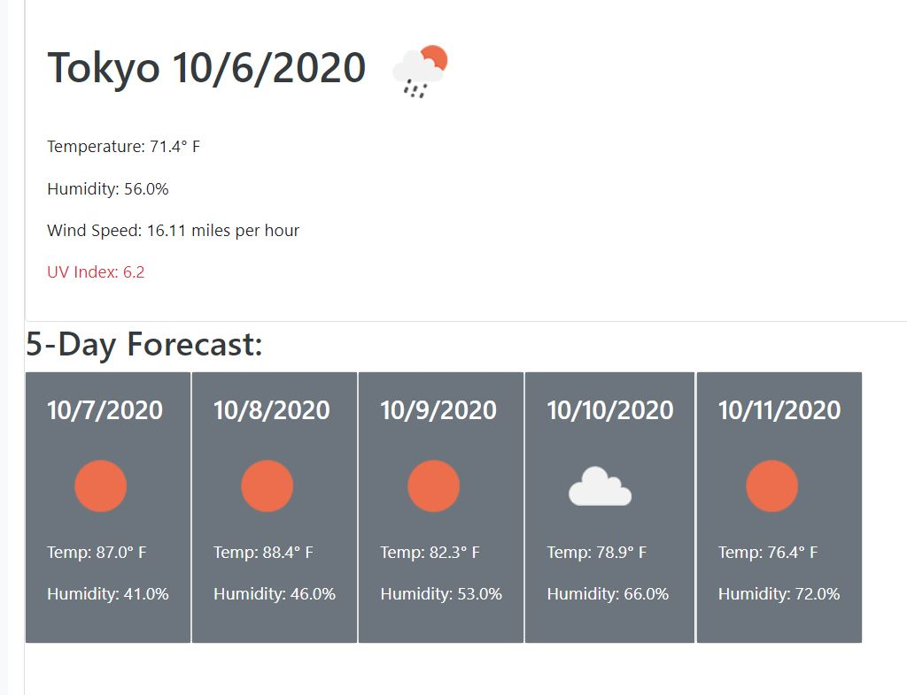
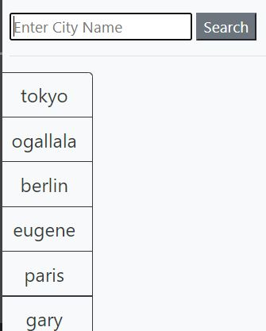

# Weather App

A weather application using open weather API.  The user can search for the weather of various cities, and get today's weather as well as a 5 day forecast.  The user can also click on past searches to see the weather for places they've recently searched.

## Link

https://carl-33.github.io/Weather/

## Usage Instructions

Enter a city in the search bar to see the weather.

The current weather in the city is provided, as well as a 5-day forecast

Click on past searches to see results again

# Installation Instructions

N/A

# Thanks

Open weather for providing the API
